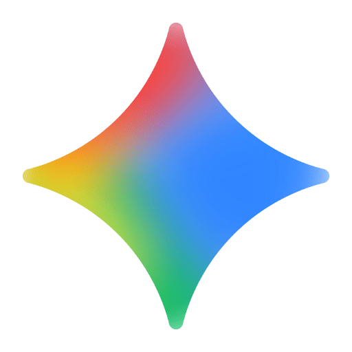

  
  &nbsp;
  
  &nbsp;
  

 

  

---

## ⚡ About Me

- 🎓 **Final-Year Undergraduate** at **IIT Guwahati**.
- 📊 **Product & Data Analytics**: Turning messy data into clear product metrics, cohort insights, and strategic decisions.
- 🤝 **Open for Collaborations**: Eager to build impactful projects in Data Science, Product Analytics, and AI workflows.

> *"Without data, you're just another person with an opinion."* — W. Edwards Deming

 

## 🛠️ Core Toolkit

  
    
  
    
  
  &nbsp;&nbsp;&nbsp;
  
  &nbsp;&nbsp;&nbsp;
  
  &nbsp;&nbsp;&nbsp;
  

 

  

